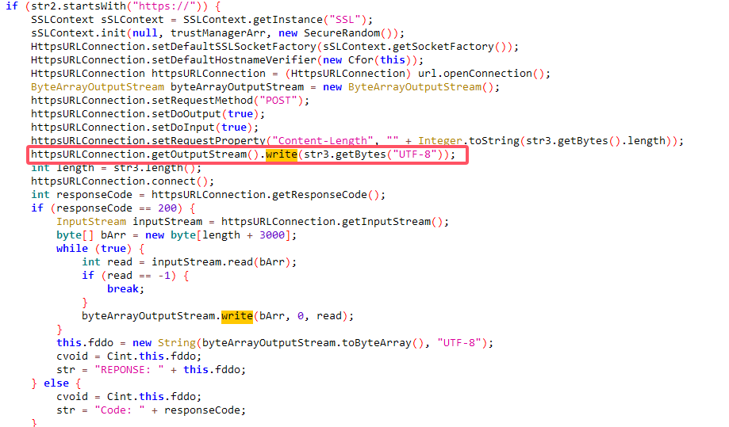

# Abuse Examples

This page presents the code snippets of the NLS abuse discussed in Section 5.3, which were collected during our manual analysis.

## Inadvertent Exposure

- *"an app with over 100K downloads, designed to recover deleted social media messages [11], stores plaintext notificationcontent in external storage."*

## Deliberate Harvesting

- Malwares that steal social media notifications.

------

- *"A tool app for downloading videos on Instagram was found to be recording and storing all Instagram notification content in its database."*

---

### Unwarranted Notification Cancellation

- *"For malware, we found cases where they cancel banking alerts to cover their malicious activities"*

------

- *"unofficial Reddit browsing apps that exploit the notification dismissal capability for destructive competition."*

## Notification Interaction with Unsolicited Crafted Content

- *"Malware that Abuse NLS to spread malware links through WhatsApp messages"*

-----

- *"Some auto-reply apps that include promotional links when responding to instant messages"*

